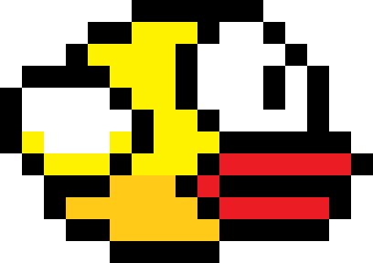

# Flappy Bird Game 🎮

## Overview
I built a **Flappy Bird game using JavaScript** by following a YouTube tutorial. The project focuses on **game physics, collision detection, and canvas-based animations**.

## Features
- Smooth bird movement with gravity effect
- Dynamic pipe generation
- Score tracking
- Game over screen
- Sound effects

## Technologies Used
- HTML
- CSS
- JavaScript

## How to Run
1. Clone the repository:
   ```bash
   git clone https://github.com/yourusername/flappybirdgame.git
   ```
2. Navigate to the project folder:
   ```bash
   cd flappybirdgame
   ```
3. Open the `index.html` file in your browser.

## Preview


## Acknowledgment
Inspired by a YouTube tutorial for learning JavaScript-based game development.

## License
This project is for educational purposes only.

